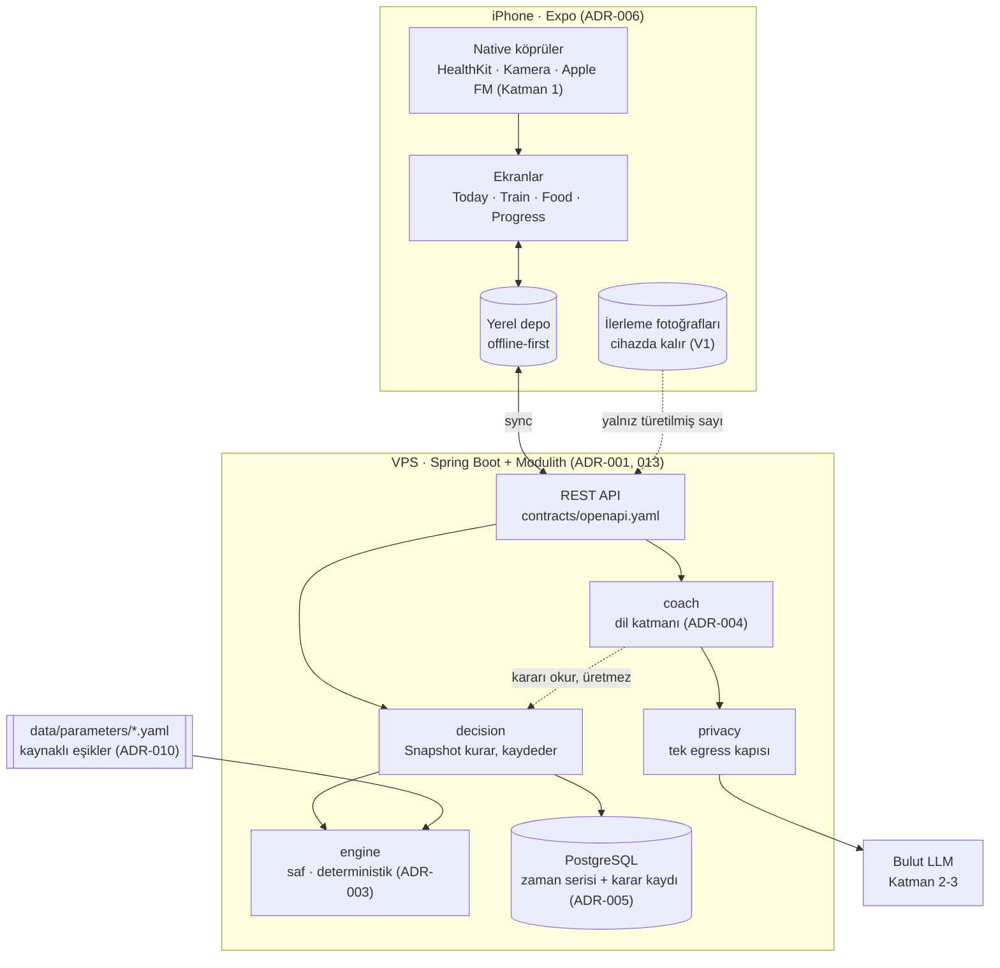

# Mimari — bütün resim

> Kararların kendisi ADR'lerde (`plan/kararlar.md`). Bu dosya onları tek resimde birleştirir; bir ADR değişince
> burası da güncellenir.

## Tek cümle
Mobil uygulama veriyi toplar ve gösterir; **backend'deki saf karar motoru karar verir**; LLM yalnız o kararı anlatır ve
serbest metni yapılandırır.

## Katmanlar

## Tek koşan örnek: pazartesi check-in
1. Kullanıcı pazartesi uygulamayı açar; mobil, haftalık soru bütçesinden 2 soru sorar (U9) ve cevapları yerel depoya yazar.
2. Yerel depo sunucuya senkronlar. `decision` modülü o kullanıcının son 3 haftalık kilo, öğün, antrenman ve cevaplarından
   bir **Snapshot** kurar.
3. `engine` Snapshot'ı sabit sırayla değerlendirir: güvenlik ağı → veri yeterli mi → yön → görüntü → antrenman →
   toparlanma → kalori (ADR-003). İlk karar veren adım durur. Çıktı: `Decision{action, reasons, confidence, nextReview,
   copyKey}`.
4. `decision` kararı Snapshot ve motor sürümüyle kaydeder.
5. Mobil kararı çeker, metni `data/copy/en.json`'dan anahtarla çözer, siyah karar kartında gösterir.
6. Kullanıcı "neden?" derse gerekçe listesi (veri + kural + kaynak etiketi) açılır. Kullanıcı itiraz ederse `coach`
   anlatır ama kararı **değiştiremez**; kararı yalnız yeni veri değiştirir (U2).

## Modüller
Tam liste ve izinli bağımlılıklar: ADR-015. Özet: `engine` hiçbir şeye bağlı değil; `coach` `engine`'e değil
`decision`'a bağlı; dışarı giden her çağrı `privacy`'den geçer.

## Veri nereden gelir
| Veri | Kaynak | Kullanıcı yükü |
|---|---|---|
| Kilo | Akıllı tartı → HealthKit, yoksa elle | 0-10 sn/gün |
| Adım, uyku | HealthKit | 0 |
| Antrenman | Set işaretleme + serbest metin | Zaten salonda |
| Öğün | Fotoğraf · metin · barkod · "dünkü gibi" → veritabanı eşlemesi → **aralık** | ~10 sn/öğün |
| Bel | Yalnız sinyaller çelişince istenir | ayda ≤1 |
| İlerleme fotoğrafı | Rehberli çekim, 4 haftada bir, cihazda | 60 sn/ay |

## Güvenlik ve gizlilik sınırları
- Sağlık verisi logda yok (V3); fotoğraf cihazda (V1); üçüncü taraf AI rızadan sonra (V2).
- Yetki ve kota sunucuda (ADR-012). Sırlar ortam değişkeninde (V5).

## Test sınırları
- `engine`: tablo testleri (Güray karar ağacı birebir).
- Mimari: Modulith `verify()`, modül listesi, satır içi sürüm yok, parametre kaynağı dolu.
- Mobil: `tsc` + lint + Jest. CI her push'ta ikisini çalıştırır (ADR-009).
